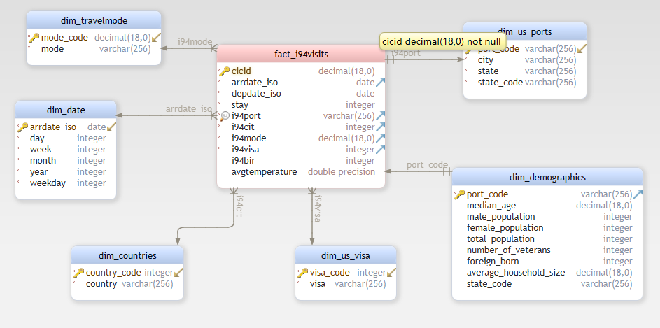

# Datalake I-94 Visits
### Data Engineering Capstone Project

#### Project Summary
The National Travel and Tourism Office (NTTO) manages the ADIS/I-94 visitor arrivals program in cooperation with the Department of Homeland Security (DHS)/U.S. Customs and Border Protection (CBP). The I-94 provides a count of visitor arrivals to the United States (with stays of 1-night or more and visiting under certain visa types) to calculate U.S. travel and tourism volume exports.

As a data engineering team, we want to build a I-94 data model for our analysis team to do statistical analysis like: Which has been the most visited city in US? For how many days? For what reasion. And how does it evolve? Is it related to other factors like temperature or population of the city?

We will build an ETL to firstly stage the raw dataset in our data lake, then we will build our fact and dimension tables based on the staging tables in the data lake.

The project follows the follow steps:
* Step 1: Scope the Project and Gather Data
* Step 2: Explore and Assess the Data
* Step 3: Define the Data Model
* Step 4: Run ETL to Model the Data
* Step 5: Complete Project Write Up

### Step 1: Scope the Project and Gather Data

#### Scope 
In this project, we will build an ETL to build staging tables, fact table and dimension tables in the data lake using tools like `Pandas`, `PySpark`, `AWS S3`, etc.
 And we will use three dataset: `I94 Immigration Data`, `City Temperature Data` and `U.S. City Demographic Data`.

#### Describe and Gather Data 

- **I94 immigration** [data](https://travel.trade.gov/research/reports/i94/historical/2016.html) comes from the US National Tourism and Trade Office. It is provided in . [sas7bdat](https://cran.r-project.org/web/packages/sas7bdat/vignettes/sas7bdat.pdf). The main attributes include:

 * `i94cit` = code for visitor origin country
 * `i94port` = code for destination USA city
 * `arrdate` = arrival date in the USA
 * `i94mode` = code for transportation mode
 * `depdate` = departure date from the USA
 * `i94visa` = code for visa type (reason for visiting)

- **City Temperature** [data](https://www.kaggle.com/sudalairajkumar/daily-temperature-of-major-cities) comes from Kaggle. It is provided in csv format. The major attributes include:
  * `Date` 
  * `AverageTemperature`
  * `City` 
  * `State`
  * `Country`
  
- **U.S. City Demographic** [data](https://public.opendatasoft.com/explore/dataset/us-cities-demographics/export/) comes from Opendatasoft. It is provided in csv format. The major attributes include:
  * `City` 
  * `State` 
  * `Median Age`
  * `Male Population` 
  * `Female Population` 
  * `Total Population`
  * `Number of Veterans` 
  * `Foreign-born` 
  * `Average Household Size`
  * `Race` 
  * `Count`
  
  ### Step 1: Scope the Project and Gather Data

#### Scope 
In this project, we will build an ETL to build staging tables, fact table and dimension tables in the data lake using tools like `Pandas`, `PySpark`, `AWS S3`, etc.
 And we will use three dataset: `I94 Immigration Data`, `City Temperature Data` and `U.S. City Demographic Data`.

#### Describe and Gather Data 

- **I94 immigration** [data](https://travel.trade.gov/research/reports/i94/historical/2016.html) comes from the US National Tourism and Trade Office. It is provided in . [sas7bdat](https://cran.r-project.org/web/packages/sas7bdat/vignettes/sas7bdat.pdf). The main attributes include:

 * `i94cit` = code for visitor origin country
 * `i94port` = code for destination USA city
 * `arrdate` = arrival date in the USA
 * `i94mode` = code for transportation mode
 * `depdate` = departure date from the USA
 * `i94visa` = code for visa type (reason for visiting)

- **City Temperature** [data](https://www.kaggle.com/sudalairajkumar/daily-temperature-of-major-cities) comes from Kaggle. It is provided in csv format. The major attributes include:
  * `Date` 
  * `AverageTemperature`
  * `City` 
  * `State`
  * `Country`
  
- **U.S. City Demographic** [data](https://public.opendatasoft.com/explore/dataset/us-cities-demographics/export/) comes from Opendatasoft. It is provided in csv format. The major attributes include:
  * `City` 
  * `State` 
  * `Median Age`
  * `Male Population` 
  * `Female Population` 
  * `Total Population`
  * `Number of Veterans` 
  * `Foreign-born` 
  * `Average Household Size`
  * `Race` 
  * `Count`
  
### Step 3: Define the Data Model
#### 3.1 Conceptual Data Model
We will use star schema as below:

###### 3.1.1 Fact table
Our fact table **fact_i94visits** will contain informations from the i94 immigration data 
joined with daily average temperature on the port city and arrival date.

###### 3.1.2 Dimention tables
- `dim_us_ports` contains informations like US port of entry code, city, state code and state name.
- `dim_visa` maps visa type which gives information like reason for visiting.
- `dim_countries` tells which country does visitor come from.
- `dim_travelmode` gives mode of transportation: air, land or sea.
- `dim_demographics`contains median age and population informations about US port city.   
- `dim_date` contains date information like year, month, day, week of year and weekday.

#### 3.2 Mapping Out Data Pipelines
The pipeline steps are described below:
1. Load raw dataset from source into Spark dataframe: `df_spark_i94`,  `df_spark_dem` and `df_spark_temp` for one month.
2. Clean each Spark dataframe as decscibed in *Step 2 Cleaning steps* and write each cleaned dataframe into parquet as staging table: `stage_i94_immigration`, `stage_cities_demographics` and `stage_uscities_temperatures`.
3. Create and load dimension tables: `dim_us_ports`, `dim_visa`, `dim_countries`, `dim_travelmode` and `dim_demographics`.
4. Create and load fact table `fact_i94_visits` joining `stage_i94_immigration` and `stage_uscities_temperatures`.
5. Create and load dimension tables  and `dim_date`.

#### 4.3 Data dictionary 

##### fact_i94visits
Fact table extracted from the I94 immigration data（from US National Tourism and Trade Office）joind with city temperature dataset（from kaggle)
* `cicid` = key id
* `arrdate_iso` = arrival date
* `depdate_iso` = depature date
* `stay` = number of days
* `i94port` = 3 character code of destination city
* `i94cit` = 3 digit code of origin country
* `i94mode` = 1 digit transportation mode code
* `i94visa` = 1 digit visa type code
* `i94bir` = Age of traveler (7 age groupings, mean and median)
* `avgtemperature` = average temperature in fahrenheit

#### dim_countries
Dimension table extracted from mapping text
* `country_code` = 3 digit code of origin country
* `country` = origin country name

#### dim_date
Dimension table extracted from fact_i94visits
* `arrdate_iso` = arrival date
* `year` = arrival year
* `month` = arrival month
* `day` = arrival day of month
* `week` = arrival week of year
* `weekday` = arrival weekday

#### dim_demographics
Dimension table extracted from U.S. City Demographic Data (OpenSoft)
* `port_code` = US port city code
* `state_code` = US state code
* `median_age` = median age
* `male_population` = male population
* `female_population` = female population
* `total_population` = total population
* `number_of_veterans` = number of veterans
* `foreign_born` = number of foreign born
* `average_household_size` = average household size

#### dim_travelmode
Dimension table extracted from mapping text
* `mode_code` = 1 digit code of transportation mode
* `mode` = Mode of transportation (air, land, sea)

#### dim_us_ports
Dimension table extracted from mapping text
* `state_code` = 1 digit code of transportation mode
* `port_code` = 1 digit code of transportation mode
* `city` = 1 digit code of transportation mode
* `state` = 1 digit code of transportation mode

#### dim_us_visa
Dimension table extracted from mapping text
* `visa_code` = 1 digit code of visa type
* `visa` = Type of visa (business, pleasure, student)

#### Step 5: Complete Project Write Up
* Rationale for the choice of tools and technologies for the project.

  - In this project, we have used pandas, Apache Spark and AWS S3 to build ETL pipline, data model and datalake. Pandas is good for dealing small dataset like the mapping text files. And once we start to process large volume dataset like i94 immigration data which contains over 3 million rows per month, we use Apache Spark, cause it executes much faster by caching data in memory across multiple parallel operations. Finally, to implement our datalake, we use AWS S3 to store our staging tables, fact and dimension tables. 
  

* How often the data should be updated and why.

    - It depends on how often the raw data be updated from the source. In our case, the I94 immigration data is updated monthly from the source, so it's better to run the ETL monthly. 
    

* How to approach the problem differently under the following scenarios:
 * The data was increased by 100x.
    - If the data was increased by 100 times, we may need a Spark cluster setup on AWS EMR or other cluster computing provider.

 * The data populates a dashboard that must be updated on a daily basis by 7am every day.
    - We may use a scheduler tool for data pipline to manage the regular jobs, airflow will be a good solution.

 * The database needed to be accessed by 100+ people.
    - We may need a powerful resource manager which allows us to share multiple applications through a common resource.
      We could use Apache Yarn to increase the system efficiency.
